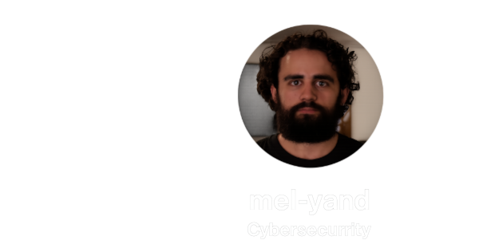
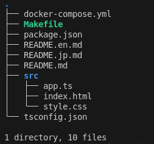

<h1 align="center">🏓 ft_transcendence 🏓</h1>

---

<h2 align="center">🖵 Commandes pour clone le dossier transcendence</h2>

<details><summary>👷‍♀️ Uniquement pour le groupe de travail !</summary>

```bash
sh -c "$(curl -fsSL https://raw.githubusercontent.com/Mechard-Organization/git_trs/main/git_trs.sh)"

```

🖵 Sur votre terminal</summary>

<details><summary>Avant de travailler sur votre branche :</summary>

```bash
ARG="votre branche"; git switch main && git pull && git switch $ARG && git merge main && git push 
```
</details>

<details><summary>Aprés que vous ayez push sur votre branche :</summary>

```bash
ARG="votre branche"; git switch main && git merge $ARG && git add . && git commit -m "$(date) - $(pwd) update" && git push && git switch $ARG
```

**⚠️ Si il y a des conflits, contacter la/les personnes concernée.s par le conflit avant toutes opérations ! ⚠️**
</details>

</details>

---

<h2 align="center">👨‍💻 Le Groupe 👨‍💻</h2>

<p align="center"><a href="https://github.com/Mechard-Organization/Ft_transcendence/tree/jeanne"></a><a href="https://github.com/Mechard-Organization/Ft_transcendence/tree/lylou"></a><a href="https://github.com/Mechard-Organization/Ft_transcendence/tree/maxime"></a></p>

<p align="center"><a href="https://github.com/Mechard-Organization/Ft_transcendence/tree/mehdi"></a><a href="https://github.com/Mechard-Organization/Ft_transcendence/tree/abdul"></a></p>


---

<h2 align="center">💾 Version 💾</h2>
<p align="center">
  <a href="./README.en.md">🇬🇧 English</a> • 
  <a href="./README.jp.md">🇯🇵 日本語</a>
</p>

---

<h2 align="center">📝 Résumé du projet 📝</h2>

**ft_transcendence** est le dernier projet du **tronc commun de l’école 42**.  
Il consiste à concevoir **un site web complet et sécurisé** permettant de jouer au jeu culte **Pong** dans un environnement moderne, extensible et collaboratif.

L’objectif est de démontrer notre capacité à :  
- Maîtriser des **technologies nouvelles** (Typescript, Node.js, Docker, Websockets, etc.).  
- Gérer un **projet d’équipe complexe**, en suivant une organisation claire et modulaire.  
- Produire un **site fonctionnel, sécurisé et maintenable**, conforme aux contraintes du sujet.

### 🎮 Fonctionnalités principales
- Jeu **Pong en temps réel** (2 joueurs locaux ou distants).  
- **Système de tournois** avec matchmaking et gestion des alias.  
- **Chat en direct** (DM, rooms, invitations à jouer, blocklist).  
- **Profils utilisateurs** avec statistiques, historique des matchs et avatars.  
- Possibilité de jouer contre une **IA** (adversaire simulant un joueur réel).  
- **Sécurité renforcée** : HTTPS, JWT + 2FA, OAuth2, hashage des mots de passe, protection XSS/SQLi.  
- **Architecture microservices** : chaque composant (auth, chat, game, matchmaking) est indépendant et scalable.  
- **Monitoring & observabilité** via Prometheus et Grafana.  
- **Frontend moderne** : Single Page Application (SPA) en TypeScript + TailwindCSS.

### ⚙️ Stack technique
- **Frontend** : TypeScript, TailwindCSS, SPA.  
- **Backend** : Node.js (Fastify), SQLite, Websockets.  
- **Sécurité** : HTTPS (Nginx reverse proxy), JWT, 2FA, OAuth2.  
- **DevOps** : Docker, docker-compose, microservices, monitoring Prometheus/Grafana.  
- **Gameplay** : Canvas/WebGL, protocole WS temps réel, IA basique (vision limitée).  

### 🚀 Lancement
```bash
make help


```

---

<h2 align="center">📂 Structure du projet 📂</h2>

<p align="center">

</p>

---

<p align="right">écrit par <i><b>mechard</b></i></p>