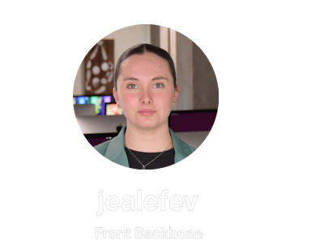

<h1 align="center">🏓 ft_transcendence 🏓</h1>

---

<h2 align="center">Commands to clone the transcendence repository</h2>

<details><summary>👷‍♀️ For the project team only!</summary>

```bash
sh -c "$(curl -fsSL https://raw.githubusercontent.com/Mechard-Organization/git_trs/main/git_trs.sh)"

```

🖵 On your terminal

<details><summary>Before working on your branch :</summary>

```bash
ARG="your branch"; git switch main && git pull && git switch $ARG && git merge main && git push 
```
</details>

<details><summary>After you have pushed to your branch :</summary>

```bash
ARG="your branch"; git switch main && git merge $ARG && git add . && git commit -m "$(date) - $(pwd) update" && git push && git switch $ARG
```

**⚠️ If there are conflicts, contact the person(s) concerned by the conflict before performing any operations ! ⚠️**
</details>

</details>

---

<h2 align="center">👨‍💻 le groupe 👨‍💻</h2>

<p align="center"><a href="https://github.com/Mechard-Organization/Ft_transcendence/tree/jeanne"></a><a href="https://github.com/Mechard-Organization/Ft_transcendence/tree/lylou"></a><a href="https://github.com/Mechard-Organization/Ft_transcendence/tree/maxime"></a></p>

<p align="center"><a href="https://github.com/Mechard-Organization/Ft_transcendence/tree/medhi"></a><a href="https://github.com/Mechard-Organization/Ft_transcendence/tree/abdul"></a></p>

---

<h2 align="center">💾 Version 💾</h2>
<p align="center">
  <a href="./README.jp.md">🇯🇵 日本語</a> • 
  <a href="https://github.com/Mechard-Organization/Ft_transcendence/tree/main">🇫🇷 Français</a>
</p>

---

<h2 align="center">📝 Project Overview 📝</h2>

**ft_transcendence** is the final project of the **42 school’s core curriculum**.  
It consists of designing a **complete and secure web application** that allows users to play the legendary **Pong** game in a modern, scalable, and collaborative environment.

The goal is to demonstrate our ability to:  
- Master **new technologies** (TypeScript, Node.js, Docker, WebSockets, etc.).  
- Manage a **complex team project**, following a clear and modular organization.  
- Deliver a **functional, secure, and maintainable website** that meets all project constraints.

### 🎮 Main Features
- **Real-time Pong game** (2 players — local or remote).  
- **Tournament system** with matchmaking and alias management.  
- **Live chat** (DMs, rooms, game invitations, blocklist).  
- **User profiles** with statistics, match history, and avatars.  
- Option to play against an **AI opponent** simulating a real player.  
- **Enhanced security**: HTTPS, JWT + 2FA, OAuth2, password hashing, XSS/SQLi protection.  
- **Microservices architecture**: each component (auth, chat, game, matchmaking) is independent and scalable.  
- **Monitoring & observability** with Prometheus and Grafana.  
- **Modern frontend**: Single Page Application (SPA) built with TypeScript + TailwindCSS.

### ⚙️ Tech Stack
- **Frontend**: TypeScript, TailwindCSS, SPA.  
- **Backend**: Node.js (Fastify), SQLite, WebSockets.  
- **Security**: HTTPS (Nginx reverse proxy), JWT, 2FA, OAuth2.  
- **DevOps**: Docker, docker-compose, microservices, Prometheus/Grafana monitoring.  
- **Gameplay**: Canvas/WebGL, real-time WS protocol, basic AI (limited vision).  

### 🚀 Launch
```bash
make help

```

---

<h2 align="center">📂 Project Structure 📂</h2>

<p align="center">

</p>

---

<p align="right">written by <i><b>mechard</b></i></p>